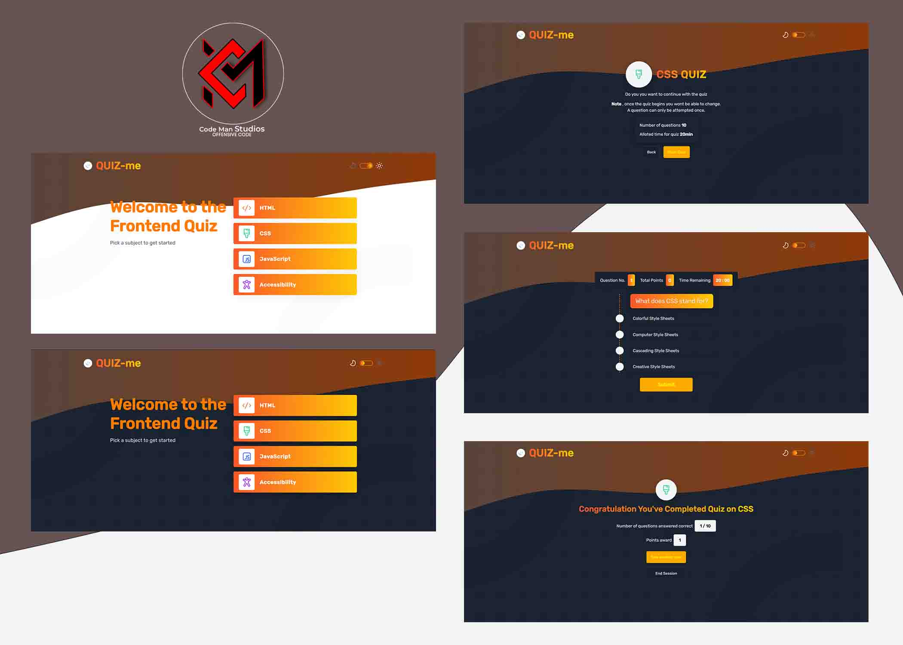

# Frontend Mentor - Frontend quiz app solution

This is a solution to the [Frontend quiz app challenge on Frontend Mentor](https://www.frontendmentor.io/challenges/frontend-quiz-app-BE7xkzXQnU). Frontend Mentor challenges help you improve your coding skills by building realistic projects. 

## Table of contents

- [Overview](#overview)
  - [The challenge](#the-challenge)
  - [Screenshot](#screenshot)
  - [Links](#links)
- [My process](#my-process)
  - [Built with](#built-with)
- [Author](#author)

 

## Overview

### The challenge

Users should be able to:

- Select a quiz subject
- Select a single answer from each question from a choice of four
- See an error message when trying to submit an answer without making a selection
- See if they have made a correct or incorrect choice when they submit an answer
- Move on to the next question after seeing the question result
- See a completed state with the score after the final question
- Play again to choose another subject
- View the optimal layout for the interface depending on their device's screen size
- See hover and focus states for all interactive elements on the page
- Navigate the entire app only using their keyboard
- **Bon us**: Change the app's theme between light and dark

### Screenshot

### Links

- Solution URL: [gitHub](https://github.com/Aboagye-Dacosta/quize_me_app)
- Live Site URL: [Quiz-me](https://quize-me-app.vercel.app/)

## My process

### Built with

- Semantic HTML5 markup
- CSS custom properties
- Flexbox
- CSS Grid
- Mobile-first workflow
- [React](https://reactjs.org/) - JS library
- [Styled Components](https://styled-components.com/) - For styles
- Framer-motion - for some simple page animations
 

## Author

 Dacosta Aboagye Solomon

  
  
  
  

